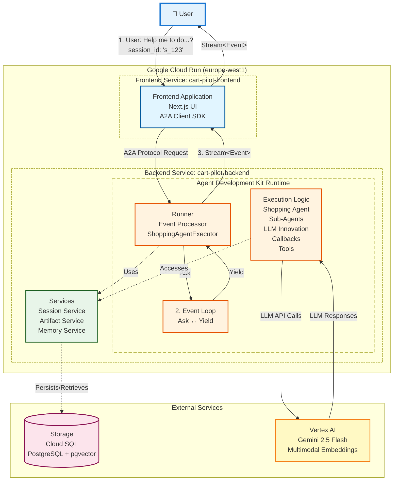
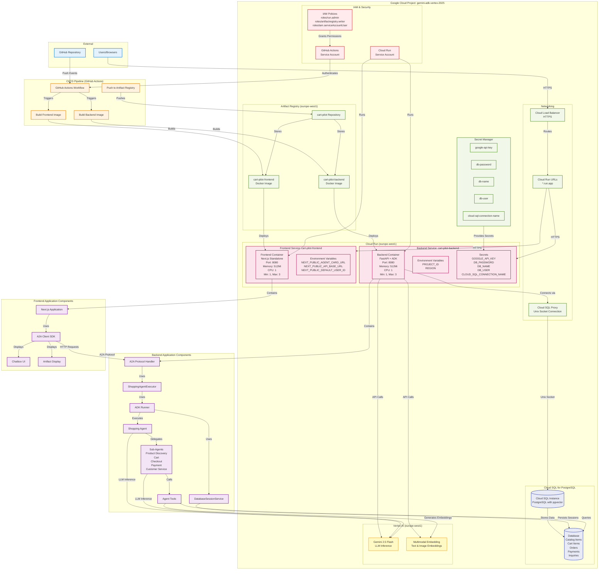
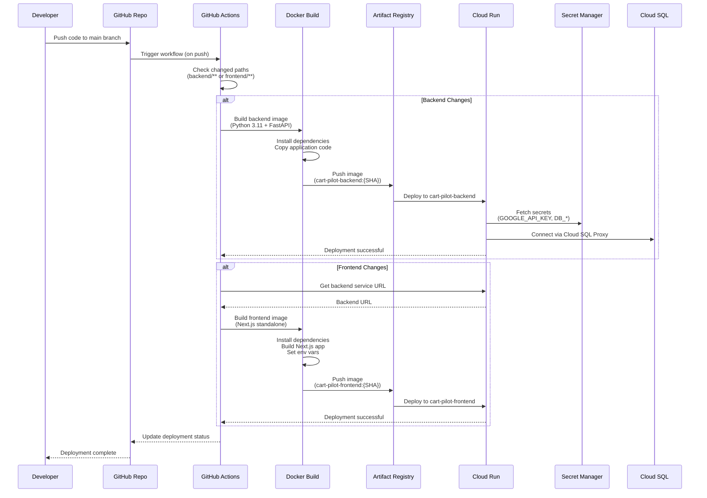
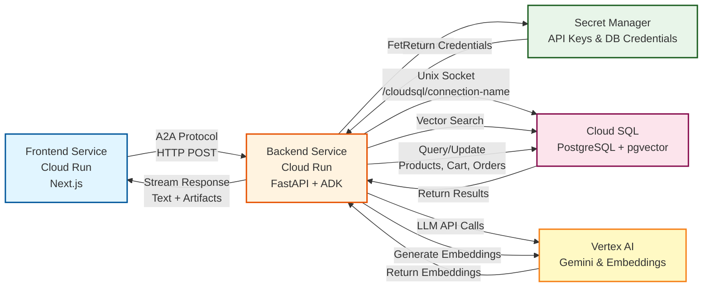
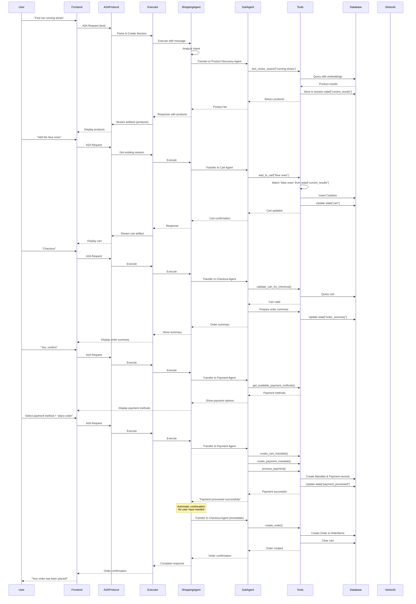

# Shopping Agent Architecture Diagram

## ADK Runtime Architecture (Google Cloud)

## Deployment Architecture Details

### Cloud Run Services

#### Backend Service (`cart-pilot-backend`)
- **Runtime**: Python 3.11 (Docker)
- **Framework**: FastAPI + Starlette (A2A Protocol)
- **Port**: 8080
- **Resources**:
  - Memory: 512Mi
  - CPU: 1
  - Min Instances: 1 (always warm)
  - Max Instances: 3
  - Timeout: 300s
- **Authentication**: Unauthenticated (public)
- **Environment Variables**:
  - `PROJECT_ID`: GCP Project ID
  - `REGION`: europe-west1
- **Secrets** (from Secret Manager):
  - `GOOGLE_API_KEY`: Vertex AI API key
  - `DB_PASSWORD`: Cloud SQL password
  - `DB_NAME`: Database name
  - `DB_USER`: Database user
  - `CLOUD_SQL_CONNECTION_NAME`: Cloud SQL connection string

#### Frontend Service (`cart-pilot-frontend`)
- **Runtime**: Node.js 20 (Docker)
- **Framework**: Next.js (Standalone build)
- **Port**: 8080
- **Resources**:
  - Memory: 512Mi
  - CPU: 1
  - Min Instances: 1
  - Max Instances: 3
  - Timeout: 300s
- **Authentication**: Unauthenticated (public)
- **Environment Variables**:
  - `NEXT_PUBLIC_AGENT_CARD_URL`: Backend agent card endpoint
  - `NEXT_PUBLIC_API_BASE_URL`: Backend service URL
  - `NEXT_PUBLIC_DEFAULT_USER_ID`: Default user ID

### Cloud SQL Database

- **Type**: Cloud SQL for PostgreSQL
- **Extension**: pgvector (for vector similarity search)
- **Connection**: Unix socket via Cloud SQL Proxy
- **Connection Name**: Stored in Secret Manager
- **Tables**:
  - `catalog_items`: Products with embeddings
  - `cart_items`: Shopping cart items
  - `orders`: Customer orders
  - `order_items`: Order line items
  - `mandates`: AP2 payment mandates
  - `payments`: Payment records
  - `customer_inquiries`: Support tickets

### Artifact Registry

- **Repository**: `cart-pilot`
- **Region**: `europe-west1`
- **Format**: Docker
- **Images**:
  - `cart-pilot-backend`: Backend service image
  - `cart-pilot-frontend`: Frontend service image
- **Tags**: `latest` and `{GITHUB_SHA}`

### Secret Manager

Stores sensitive configuration:
- `google-api-key`: Vertex AI API key
- `db-password`: Cloud SQL database password
- `db-name`: Database name
- `db-user`: Database username
- `cloud-sql-connection-name`: Cloud SQL connection string

### Vertex AI Services

- **Gemini 2.5 Flash**: LLM for agent inference
- **Multimodal Embedding Model**: Text and image embeddings for product search
- **Region**: europe-west1
- **Authentication**: Via GOOGLE_API_KEY

### CI/CD Pipeline

**GitHub Actions Workflow**:
1. **Trigger**: Push to `main` branch (changes in `frontend/**` or `backend/**`)
2. **Check Changes**: Determines which services need deployment
3. **Build**: Creates Docker images
4. **Push**: Uploads to Artifact Registry
5. **Deploy**: Updates Cloud Run services

**Service Account Permissions**:
- `roles/run.admin`: Deploy to Cloud Run
- `roles/artifactregistry.writer`: Push images
- `roles/iam.serviceAccountUser`: Use service accounts

## Network Flow

1. **User Request** → Cloud Load Balancer → Cloud Run URL
2. **Frontend** → Serves static assets and Next.js app
3. **Frontend A2A Client** → HTTP requests to Backend service
4. **Backend** → Processes A2A protocol requests
5. **Backend** → Connects to Cloud SQL via Unix socket
6. **Backend** → Calls Vertex AI APIs for LLM inference
7. **Backend** → Streams responses back to Frontend
8. **Frontend** → Updates UI with artifacts and responses

## Security Architecture

- **Secrets**: Stored in Secret Manager, injected at runtime
- **IAM**: Service accounts with least-privilege access
- **Network**: Cloud SQL uses private Unix socket connections
- **Authentication**: Public endpoints (can be secured with Cloud IAP)
- **HTTPS**: All traffic encrypted via Cloud Load Balancer

## Scalability

- **Auto-scaling**: Cloud Run scales 1-3 instances based on traffic
- **Connection Pooling**: Database connections pooled (max 10)
- **Stateless**: Both services are stateless (state in database)
- **Session Persistence**: DatabaseSessionService stores sessions in Cloud SQL

## Monitoring & Logging

- **Cloud Logging**: Automatic logging from Cloud Run
- **Cloud Monitoring**: Metrics and health checks
- **Error Reporting**: Automatic error tracking
- **Trace**: Request tracing across services

## CI/CD Deployment Flow

## Request Flow Through Google Cloud

```mermaid
graph TB
    %% Frontend Layer
    subgraph Frontend["Frontend (Next.js)"]
        UI[User Interface]
        A2AClient[A2A Client SDK]
        Chatbox[Chatbox Component]
        ArtifactDisplay[Artifact Display Components]
    end

    %% API Gateway Layer
    subgraph Backend["Backend (Starlette/FastAPI)"]
        subgraph A2AProtocol["A2A Protocol Layer"]
            AgentCard[Agent Card Endpoint]
            RequestHandler[Default Request Handler]
            TaskStore[InMemory Task Store]
        end
        
        subgraph Executor["Agent Executor"]
            ShoppingExecutor[ShoppingAgentExecutor]
            MessageParser[Message Parser]
            ContentBuilder[Content Builder]
            SessionManager[Session Manager]
            StateTracker[State Tracker]
            ArtifactStreamer[Artifact Streamer]
            StatusHandler[Status Message Handler]
        end
        
        subgraph ADKCore["ADK Core Services"]
            Runner[ADK Runner]
            SessionService[DatabaseSessionService]
            ArtifactService[InMemoryArtifactService]
            MemoryService[InMemoryMemoryService]
        end
    end

    %% Agent Layer
    subgraph Agents["Agent Hierarchy"]
        RootAgent[Shopping Agent<br/>Root Orchestrator]
        
        subgraph SubAgents["Sub-Agents"]
            ProductAgent[Product Discovery Agent]
            CartAgent[Cart Agent]
            CheckoutAgent[Checkout Agent]
            CustomerAgent[Customer Service Agent]
            PaymentAgent[Payment Agent]
        end
    end

    %% Tools Layer
    subgraph Tools["Agent Tools"]
        subgraph ProductTools["Product Discovery Tools"]
            TextSearch[text_vector_search]
            ImageSearch[image_vector_search]
        end
        
        subgraph CartTools["Cart Tools"]
            AddToCart[add_to_cart]
            GetCart[get_cart]
            UpdateCart[update_cart_item]
            RemoveCart[remove_from_cart]
            ClearCart[clear_cart]
            CartTotal[get_cart_total]
        end
        
        subgraph CheckoutTools["Checkout Tools"]
            ValidateCart[validate_cart_for_checkout]
            CreateOrder[create_order]
            OrderStatus[get_order_status]
            CancelOrder[cancel_order]
        end
        
        subgraph PaymentTools["Payment Tools"]
            GetPaymentMethods[get_available_payment_methods]
            CreateCartMandate[create_cart_mandate]
            CreatePaymentMandate[create_payment_mandate]
            ProcessPayment[process_payment]
        end
        
        subgraph CustomerTools["Customer Service Tools"]
            CreateInquiry[create_inquiry]
            GetInquiryStatus[get_inquiry_status]
            SearchFAQ[search_faq]
            InitiateReturn[initiate_return]
        end
    end

    %% Database Layer
    subgraph Database["PostgreSQL Database"]
        subgraph Models["Data Models"]
            CatalogItems[CatalogItem<br/>with pgvector embeddings]
            CartItems[CartItem]
            Orders[Order]
            OrderItems[OrderItem]
            Mandates[Mandate]
            Payments[Payment]
            Inquiries[CustomerInquiry]
        end
        
        DBConnection[(PostgreSQL<br/>with pgvector)]
    end

    %% External Services
    subgraph External["External Services"]
        VertexAI[Vertex AI<br/>Gemini Model]
        EmbeddingService[Vertex AI<br/>Multimodal Embedding]
    end

    %% Flow connections
    UI -->|User Input| A2AClient
    A2AClient -->|A2A Protocol| AgentCard
    AgentCard --> RequestHandler
    RequestHandler --> ShoppingExecutor
    
    ShoppingExecutor --> MessageParser
    ShoppingExecutor --> ContentBuilder
    ShoppingExecutor --> SessionManager
    ShoppingExecutor --> StateTracker
    ShoppingExecutor --> ArtifactStreamer
    ShoppingExecutor --> StatusHandler
    ShoppingExecutor --> Runner
    
    Runner --> SessionService
    Runner --> ArtifactService
    Runner --> MemoryService
    Runner --> RootAgent
    
    RootAgent -->|Delegates| ProductAgent
    RootAgent -->|Delegates| CartAgent
    RootAgent -->|Delegates| CheckoutAgent
    RootAgent -->|Delegates| CustomerAgent
    RootAgent -->|Delegates| PaymentAgent
    
    ProductAgent --> TextSearch
    ProductAgent --> ImageSearch
    
    CartAgent --> AddToCart
    CartAgent --> GetCart
    CartAgent --> UpdateCart
    CartAgent --> RemoveCart
    CartAgent --> ClearCart
    CartAgent --> CartTotal
    
    CheckoutAgent --> ValidateCart
    CheckoutAgent --> CreateOrder
    CheckoutAgent --> OrderStatus
    CheckoutAgent --> CancelOrder
    
    PaymentAgent --> GetPaymentMethods
    PaymentAgent --> CreateCartMandate
    PaymentAgent --> CreatePaymentMandate
    PaymentAgent --> ProcessPayment
    
    CustomerAgent --> CreateInquiry
    CustomerAgent --> GetInquiryStatus
    CustomerAgent --> SearchFAQ
    CustomerAgent --> InitiateReturn
    
    TextSearch --> DBConnection
    ImageSearch --> DBConnection
    AddToCart --> DBConnection
    GetCart --> DBConnection
    UpdateCart --> DBConnection
    RemoveCart --> DBConnection
    ClearCart --> DBConnection
    CartTotal --> DBConnection
    ValidateCart --> DBConnection
    CreateOrder --> DBConnection
    OrderStatus --> DBConnection
    CancelOrder --> DBConnection
    CreateCartMandate --> DBConnection
    CreatePaymentMandate --> DBConnection
    ProcessPayment --> DBConnection
    CreateInquiry --> DBConnection
    GetInquiryStatus --> DBConnection
    SearchFAQ --> DBConnection
    InitiateReturn --> DBConnection
    
    DBConnection --> CatalogItems
    DBConnection --> CartItems
    DBConnection --> Orders
    DBConnection --> OrderItems
    DBConnection --> Mandates
    DBConnection --> Payments
    DBConnection --> Inquiries
    
    TextSearch --> EmbeddingService
    ImageSearch --> EmbeddingService
    
    RootAgent --> VertexAI
    ProductAgent --> VertexAI
    CartAgent --> VertexAI
    CheckoutAgent --> VertexAI
    CustomerAgent --> VertexAI
    PaymentAgent --> VertexAI
    
    SessionService -->|Persists State| DBConnection
    
    Runner -->|Streams Events| ArtifactStreamer
    ArtifactStreamer -->|A2A Events| RequestHandler
    RequestHandler -->|A2A Response| A2AClient
    A2AClient -->|Updates UI| Chatbox
    A2AClient -->|Displays Artifacts| ArtifactDisplay

    %% Styling
    classDef frontend fill:#e1f5ff,stroke:#01579b,stroke-width:2px
    classDef backend fill:#fff3e0,stroke:#e65100,stroke-width:2px
    classDef agent fill:#f3e5f5,stroke:#4a148c,stroke-width:2px
    classDef tool fill:#e8f5e9,stroke:#1b5e20,stroke-width:2px
    classDef database fill:#fce4ec,stroke:#880e4f,stroke-width:2px
    classDef external fill:#fff9c4,stroke:#f57f17,stroke-width:2px
    
    class UI,A2AClient,Chatbox,ArtifactDisplay frontend
    class AgentCard,RequestHandler,TaskStore,ShoppingExecutor,MessageParser,ContentBuilder,SessionManager,StateTracker,ArtifactStreamer,StatusHandler,Runner,SessionService,ArtifactService,MemoryService backend
    class RootAgent,ProductAgent,CartAgent,CheckoutAgent,CustomerAgent,PaymentAgent agent
    class TextSearch,ImageSearch,AddToCart,GetCart,UpdateCart,RemoveCart,ClearCart,CartTotal,ValidateCart,CreateOrder,OrderStatus,CancelOrder,GetPaymentMethods,CreateCartMandate,CreatePaymentMandate,ProcessPayment,CreateInquiry,GetInquiryStatus,SearchFAQ,InitiateReturn tool
    class DBConnection,CatalogItems,CartItems,Orders,OrderItems,Mandates,Payments,Inquiries database
    class VertexAI,EmbeddingService external
```

## User Journey Flow Diagram

## Architecture Flow Description

### Request Flow

1. **User Input** → Frontend UI captures user message (text/image)
2. **A2A Client** → Wraps message in A2A protocol format with contextId
3. **Agent Card** → Returns agent capabilities metadata
4. **Request Handler** → Processes A2A request, creates task
5. **Agent Executor** → Parses message, manages session, builds content
6. **ADK Runner** → Executes agent with session context
7. **Shopping Agent** → Analyzes intent, delegates to sub-agent
8. **Sub-Agent** → Uses specialized tools to fulfill request
9. **Tools** → Interact with database, update session state
10. **State Updates** → Detected by executor, artifacts streamed back
11. **Response** → Streamed to frontend via A2A protocol

### Key Components

#### Frontend Layer
- **Next.js Application**: React-based UI
- **A2A Client SDK**: Handles agent-to-agent protocol communication
- **Chatbox**: Main conversation interface
- **Artifact Display**: Shows products, cart, orders as structured data

#### Backend Layer
- **A2A Protocol**: JSON-RPC 2.0 based agent communication
- **Agent Executor**: Bridges A2A to ADK, handles session management
- **ADK Runner**: Core agent execution engine
- **Session Service**: Database-backed persistent session storage
- **State Tracker**: Monitors state changes for artifact streaming

#### Agent Hierarchy
- **Shopping Agent**: Root orchestrator, routes to sub-agents
- **Product Discovery**: Semantic and visual product search
- **Cart Agent**: Shopping cart management
- **Checkout Agent**: Order creation and management
- **Payment Agent**: Payment processing with AP2 mandates
- **Customer Service**: Support, returns, inquiries

#### Database Layer
- **PostgreSQL**: Primary data store
- **pgvector**: Vector similarity search for products
- **Models**: Catalog, Cart, Orders, Payments, Inquiries

#### External Services
- **Vertex AI**: LLM inference (Gemini models)
- **Multimodal Embedding**: Text and image embeddings for search

### State Management

- **Session State**: Stored in database via DatabaseSessionService
- **Shared State**: All agents access same session state
- **State Keys**:
  - `current_results`: Product search results
  - `cart`: Current cart items
  - `order_summary`: Prepared order summary
  - `payment_processed`: Payment completion flag
  - `current_image_bytes`: Uploaded image data

### Artifact Streaming

- **Real-time Updates**: State changes trigger artifact streaming
- **Artifact Types**: Products, Cart, Orders, Payment Methods
- **Incremental Updates**: Only changed artifacts are sent
- **Format**: Structured JSON via A2A protocol

